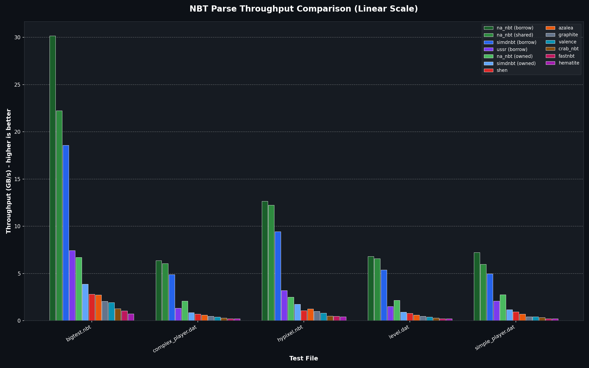
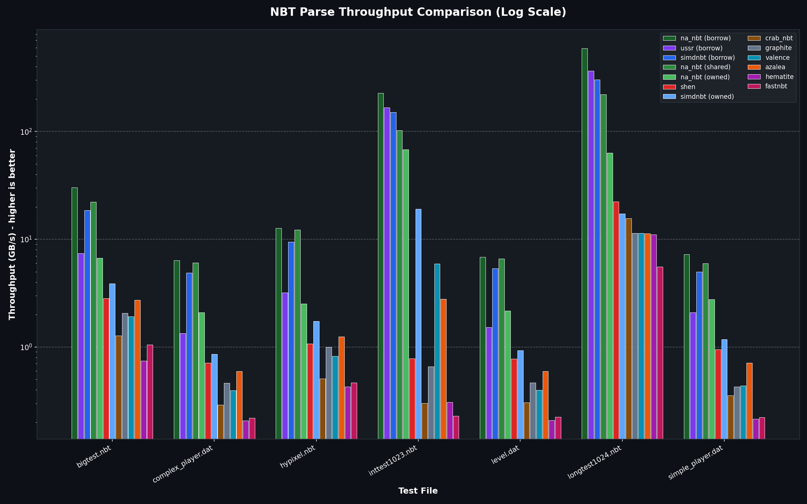
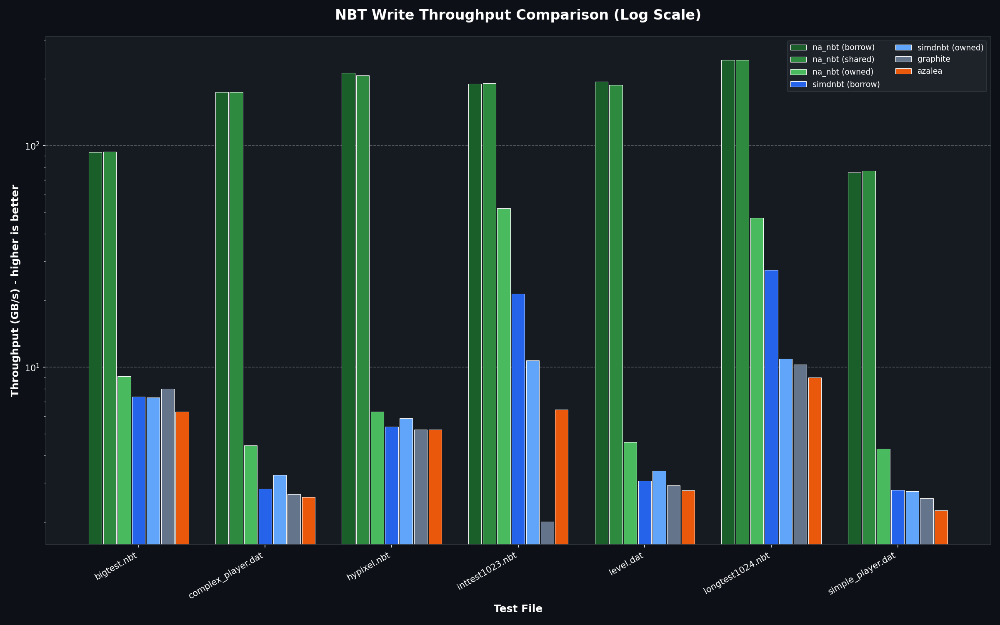

# na_nbt

A high-performance NBT (Named Binary Tag) library for Rust with full mutation support and serde integration.

> ⚠️ **Note:** This crate is under active development. APIs may change between versions.
> Issues and contributions are welcome!

## Features

- **Zero-copy parsing** - Read NBT data without allocating memory for values
- **Full mutation** - Create and modify NBT structures with an owned representation  
- **Endianness support** - Convert between BigEndian and LittleEndian on read or write
- **Generic traits** - Write code that works with any value type
- **Serde integration** - Serialize/deserialize Rust types directly to/from NBT (optional)
- **Shared values** - Thread-safe `Arc`-based values with `bytes` crate (optional)

## Installation

```toml
[dependencies]
na_nbt = "0.1"
```

### Optional Features

Both `serde` and `shared` features are enabled by default. To use without optional dependencies:

```toml
[dependencies]
na_nbt = { version = "0.1", default-features = false }

# Or enable only what you need:
na_nbt = { version = "0.1", default-features = false, features = ["serde"] }
```

| Feature | Description | Dependencies |
|---------|-------------|--------------|
| `serde` | Serialize/deserialize Rust types to/from NBT | `serde` |
| `shared` | `SharedValue` with Arc ownership | `bytes` |

## Todo

- [ ] **More convenient APIs**
- [ ] **Documentation**
- [ ] **Benchmarks**
- [ ] **Tests and fuzzing**
- [ ] **MSRV testing**
- [ ] **`no_std` support**
- [ ] **Older Rust support**

## Benchmarks

na_nbt is the fastest NBT library in Rust. Tests are from simdnbt's benchmark.

### Read Performance




| Library | bigtest.nbt | complex_player.dat | hypixel.nbt | inttest1023.nbt | level.dat | longtest1024.nbt | simple_player.dat |
|---|---|---|---|---|---|---|---|
| na_nbt (borrow) | 30.15 GB/s (#1) | 6.36 GB/s (#1) | 12.66 GB/s (#1) | 227.00 GB/s (#1) | 6.82 GB/s (#1) | 592.45 GB/s (#1) | 7.24 GB/s (#1) |
| na_nbt (shared) | 22.24 GB/s (#2) | 6.06 GB/s (#2) | 12.25 GB/s (#2) | 102.60 GB/s (#4) | 6.58 GB/s (#2) | 220.53 GB/s (#4) | 5.98 GB/s (#2) |
| simdnbt (borrow) | 18.56 GB/s (#3) | 4.89 GB/s (#3) | 9.45 GB/s (#3) | 150.84 GB/s (#3) | 5.38 GB/s (#3) | 302.32 GB/s (#3) | 4.97 GB/s (#3) |
| ussr (borrow) | 7.42 GB/s (#4) | 1.34 GB/s (#5) | 3.19 GB/s (#4) | 166.68 GB/s (#2) | 1.52 GB/s (#5) | 365.88 GB/s (#2) | 2.09 GB/s (#5) |
| shen | 2.82 GB/s (#7) | 0.72 GB/s (#7) | 1.08 GB/s (#8) | 0.78 GB/s (#9) | 0.77 GB/s (#7) | 22.34 GB/s (#6) | 0.95 GB/s (#7) |
| valence | 1.92 GB/s (#10) | 0.39 GB/s (#10) | 0.82 GB/s (#10) | 5.93 GB/s (#7) | 0.40 GB/s (#10) | 11.35 GB/s (#10) | 0.44 GB/s (#9) |
| azalea | 2.73 GB/s (#8) | 0.59 GB/s (#8) | 1.25 GB/s (#7) | 2.78 GB/s (#8) | 0.59 GB/s (#8) | 11.30 GB/s (#11) | 0.71 GB/s (#8) |
| crab_nbt | 1.28 GB/s (#11) | 0.29 GB/s (#11) | 0.51 GB/s (#11) | 0.30 GB/s (#12) | 0.31 GB/s (#11) | 15.67 GB/s (#8) | 0.35 GB/s (#11) |
| graphite | 2.06 GB/s (#9) | 0.46 GB/s (#9) | 1.00 GB/s (#9) | 0.66 GB/s (#10) | 0.47 GB/s (#9) | 11.35 GB/s (#9) | 0.43 GB/s (#10) |
| hematite | 0.74 GB/s (#13) | 0.21 GB/s (#13) | 0.43 GB/s (#13) | 0.31 GB/s (#11) | 0.21 GB/s (#13) | 11.06 GB/s (#12) | 0.21 GB/s (#13) |
| fastnbt | 1.05 GB/s (#12) | 0.22 GB/s (#12) | 0.47 GB/s (#12) | 0.23 GB/s (#13) | 0.22 GB/s (#12) | 5.57 GB/s (#13) | 0.22 GB/s (#12) |
| na_nbt (owned) | 6.69 GB/s (#5) | 2.09 GB/s (#4) | 2.51 GB/s (#5) | 68.12 GB/s (#5) | 2.18 GB/s (#4) | 63.41 GB/s (#5) | 2.76 GB/s (#4) |
| simdnbt (owned) | 3.88 GB/s (#6) | 0.86 GB/s (#6) | 1.74 GB/s (#6) | 19.04 GB/s (#6) | 0.93 GB/s (#6) | 17.26 GB/s (#7) | 1.18 GB/s (#6) |

### Write Performance



| Library | bigtest.nbt | complex_player.dat | hypixel.nbt | inttest1023.nbt | level.dat | longtest1024.nbt | simple_player.dat |
|---|---|---|---|---|---|---|---|
| na_nbt (borrow) | 93.53 GB/s (#2) | 174.44 GB/s (#1) | 212.71 GB/s (#1) | 190.49 GB/s (#2) | 194.11 GB/s (#1) | 243.76 GB/s (#1) | 75.54 GB/s (#2) |
| na_nbt (shared) | 93.97 GB/s (#1) | 174.32 GB/s (#2) | 207.66 GB/s (#2) | 191.10 GB/s (#1) | 187.29 GB/s (#2) | 243.46 GB/s (#2) | 77.02 GB/s (#1) |
| na_nbt (owned) | 9.11 GB/s (#3) | 4.44 GB/s (#3) | 6.30 GB/s (#3) | 52.17 GB/s (#3) | 4.59 GB/s (#3) | 47.06 GB/s (#3) | 4.29 GB/s (#3) |
| simdnbt (borrow) | 7.37 GB/s (#5) | 2.82 GB/s (#5) | 5.39 GB/s (#5) | 21.45 GB/s (#4) | 3.07 GB/s (#5) | 27.39 GB/s (#4) | 2.79 GB/s (#4) |
| simdnbt (owned) | 7.29 GB/s (#6) | 3.26 GB/s (#4) | 5.89 GB/s (#4) | 10.75 GB/s (#5) | 3.40 GB/s (#4) | 10.93 GB/s (#5) | 2.75 GB/s (#5) |
| azalea | 6.30 GB/s (#7) | 2.60 GB/s (#7) | 5.22 GB/s (#7) | 6.44 GB/s (#6) | 2.78 GB/s (#7) | 8.98 GB/s (#7) | 2.26 GB/s (#7) |
| graphite | 7.97 GB/s (#4) | 2.67 GB/s (#6) | 5.24 GB/s (#6) | 2.01 GB/s (#7) | 2.93 GB/s (#6) | 10.27 GB/s (#6) | 2.56 GB/s (#6) |

---
*Higher throughput (GB/s) is better.*

## Quick Start - Documentation is in progress!

```rust
use na_nbt::read_borrowed;
use zerocopy::byteorder::BigEndian;

let data = [
    0x0a, 0x00, 0x00, // Compound with empty name
    0x01, 0x00, 0x03, b'f', b'o', b'o', 42u8, // Byte "foo" = 42
    0x00, // End
];

let doc = read_borrowed::<BigEndian>(&data).unwrap();
let root = doc.root();

if let Some(value) = root.get("foo") {
    assert_eq!(value.as_byte(), Some(42));
}
```

## Two Parsing Modes

| Mode | Function | Type | Use Case |
|------|----------|------|---------|
| **Zero-copy (borrowed)** | `read_borrowed` | `BorrowedValue` | Fast reads, data lives on stack/slice |
| **Zero-copy (shared)** | `read_shared` | `SharedValue` | Pass values across threads |
| **Owned** | `read_owned` | `OwnedValue` | Need to modify or outlive source data |

### Zero-Copy Mode (Borrowed)

Parses NBT without copying data. Values reference the original byte slice directly.

```rust
use na_nbt::read_borrowed;
use zerocopy::byteorder::BigEndian;

let data: &[u8] = &[0x0a, 0x00, 0x00, 0x00]; // Empty compound
let doc = read_borrowed::<BigEndian>(data).unwrap();
let root = doc.root(); // Zero-copy reference into `data`
```

### Zero-Copy Mode (Shared)

Like borrowed mode, but wraps data in `Arc` for shared ownership. Values are
`Clone`, `Send`, `Sync`, and `'static` - perfect for multi-threaded scenarios.

```rust
use na_nbt::read_shared;
use bytes::Bytes;
use zerocopy::byteorder::BigEndian;

let data = Bytes::from_static(&[0x0a, 0x00, 0x00, 0x00]);
let root = read_shared::<BigEndian>(data).unwrap();

// Can clone and send to other threads
let cloned = root.clone();
std::thread::spawn(move || {
    assert!(cloned.as_compound().is_some());
}).join().unwrap();
```

### Owned Mode

Parses NBT into an owned structure that can be modified.

```rust
use na_nbt::{read_owned, OwnedValue};
use zerocopy::byteorder::{BigEndian, LittleEndian};

let data: &[u8] = &[0x0a, 0x00, 0x00, 0x00];

// Convert from BigEndian source to LittleEndian storage
let mut root: OwnedValue<LittleEndian> = read_owned::<BigEndian, LittleEndian>(data).unwrap();

if let OwnedValue::Compound(ref mut compound) = root {
    compound.insert("score", 100i32);
}
```

## Writing Generic Code

### Trait Hierarchy

```text
ScopedReadableValue (all types)
        ▲
        │
┌───────┴───────┐
│               │
ReadableValue   ScopedWritableValue
(immutable)     (scoped mutation)
                        ▲
                        │
                  WritableValue
                  (full mutation)
```

- `ScopedReadableValue` - Base trait implemented by all value types
- `ReadableValue` - Extends `ScopedReadableValue` with document-lifetime references
- `ScopedWritableValue` - Extends `ScopedReadableValue` with scoped mutation
- `WritableValue` - Extends `ScopedWritableValue` with full mutable references

### Scoped vs Unscoped Methods

The "scoped" suffix indicates **bounded lifetime** and **indirection**:

- **Unscoped** methods (e.g., `get()`, `as_byte_array()`) return references to data already 
  stored in the value type with **document lifetime `'doc`** - can be stored independently.

- **Scoped** methods (e.g., `get_scoped()`, `as_byte_array_scoped()`) construct new view 
  types on demand with **borrow lifetime `'a`** - necessary for types like `OwnedValue` 
  that don't directly store container types.

**When to use which:**
- Use **scoped** methods when writing generic code that works with all value types
- Use **unscoped** methods when you need direct access to stored fields with longer lifetime

| Trait | Capability | Implemented By |
|-------|------------|----------------|
| `ScopedReadableValue` | Read primitives, iterate (scoped) | All value types |
| `ReadableValue` | + Document-lifetime references | `BorrowedValue`, `SharedValue`, `ImmutableValue` |
| `ScopedWritableValue` | + Mutation (scoped) | `OwnedValue`, `MutableValue` |
| `WritableValue` | + Mutable references to containers | `MutableValue` |

```rust
use na_nbt::{ScopedReadableValue, ScopedReadableCompound, ReadableString};

fn print_compound_keys<'doc>(value: &impl ScopedReadableValue<'doc>) {
    if let Some(compound) = value.as_compound_scoped() {
        for (key, _) in compound.iter() {
            println!("Key: {}", key.decode());
        }
    }
}
```

## Type Overview

### Zero-Copy Types

| Type | Description |
|------|-------------|
| `ReadonlyValue` | Underlying zero-copy value |
| `BorrowedValue` | Type alias for borrowed data |
| `SharedValue` | Type alias for `Arc`-wrapped data |

### Owned Types

| Type | Description |
|------|-------------|
| `OwnedValue` | Fully owned, mutable NBT value |
| `MutableValue` | Mutable view into an `OwnedValue` |
| `ImmutableValue` | Immutable view into an `OwnedValue` |

## Serde Integration

Serialize and deserialize Rust types directly to/from NBT binary format using [serde](https://serde.rs).

### Basic Usage

```rust
use serde::{Serialize, Deserialize};
use na_nbt::{to_vec_be, from_slice_be};

#[derive(Serialize, Deserialize, Debug, PartialEq)]
struct Player {
    name: String,
    health: f32,
    score: i32,
}

// Serialize to NBT
let player = Player {
    name: "Steve".to_string(),
    health: 20.0,
    score: 100,
};
let bytes = to_vec_be(&player).unwrap();

// Deserialize from NBT
let loaded: Player = from_slice_be(&bytes).unwrap();
assert_eq!(player, loaded);
```

### Convenience Functions

| Function | Description |
|----------|-------------|
| `to_vec_be` / `to_vec_le` | Serialize to `Vec<u8>` |
| `to_writer_be` / `to_writer_le` | Serialize to any `io::Write` |
| `from_slice_be` / `from_slice_le` | Deserialize from `&[u8]` |
| `from_reader_be` / `from_reader_le` | Deserialize from any `io::Read` |

The `_be` suffix means big-endian (Java Edition), `_le` means little-endian (Bedrock Edition).

### File I/O

```rust
use std::fs::File;
use na_nbt::{to_writer_be, from_reader_be};

// Write to file
let mut file = File::create("player.nbt")?;
to_writer_be(&mut file, &player)?;

// Read from file
let file = File::open("player.nbt")?;
let player: Player = from_reader_be(file)?;
```

### Type Mapping

| Rust Type | NBT Tag |
|-----------|---------|
| `bool`, `i8`, `u8` | Byte |
| `i16`, `u16` | Short |
| `i32`, `u32`, `char` | Int |
| `i64`, `u64` | Long |
| `f32` | Float |
| `f64` | Double |
| `String`, `&str` | String |
| `Vec<T>` | List |
| struct | Compound |
| `HashMap<String, T>` | Compound |
| `Option<T>` | Compound |
| enum variants | Various (see docs) |

### Native Array Types

NBT has efficient native array types (`ByteArray`, `IntArray`, `LongArray`).

**Deserialization is automatic!** Native arrays are detected and read correctly to `Vec<T>`:

```rust
#[derive(Deserialize)]
struct ChunkData {
    block_states: Vec<i64>,  // Auto-detects LongArray or List<Long>
    biomes: Vec<i32>,        // Auto-detects IntArray or List<Int>
    heightmap: Vec<i8>,      // Auto-detects ByteArray or List<Byte>
}
```

**For serialization**, use `#[serde(with = "...")]` for zero-copy performance:

```rust
#[derive(Serialize, Deserialize)]
struct ChunkData {
    #[serde(with = "na_nbt::long_array")]
    block_states: Vec<i64>,  // Zero-copy → LongArray
    
    #[serde(with = "na_nbt::int_array")]
    biomes: Vec<i32>,        // Zero-copy → IntArray
    
    #[serde(with = "na_nbt::byte_array")]
    heightmap: Vec<i8>,      // Zero-copy → ByteArray
}
```

For full serde documentation, see the [`de`](https://docs.rs/na_nbt/latest/na_nbt/de/) and [`ser`](https://docs.rs/na_nbt/latest/na_nbt/ser/) module docs.

## Contributing

This crate is under active development. Contributions are welcome!

- **Bug reports**: Please open an issue with a minimal reproducible example
- **Feature requests**: Open an issue describing the use case
- **Pull requests**: Fork the repo, make your changes, and submit a PR

## License

MIT OR Apache-2.0
