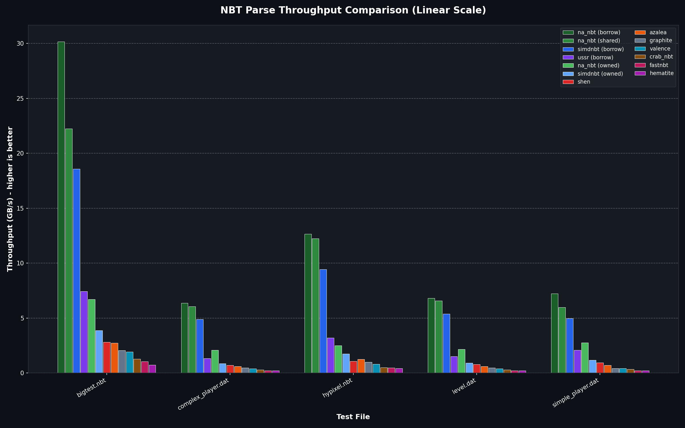
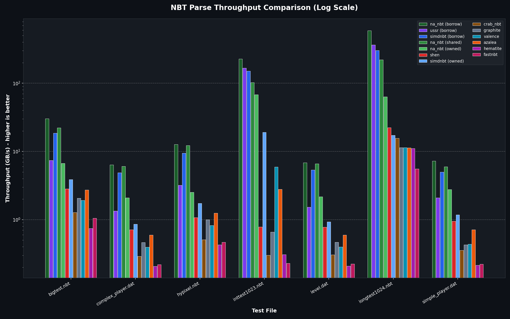
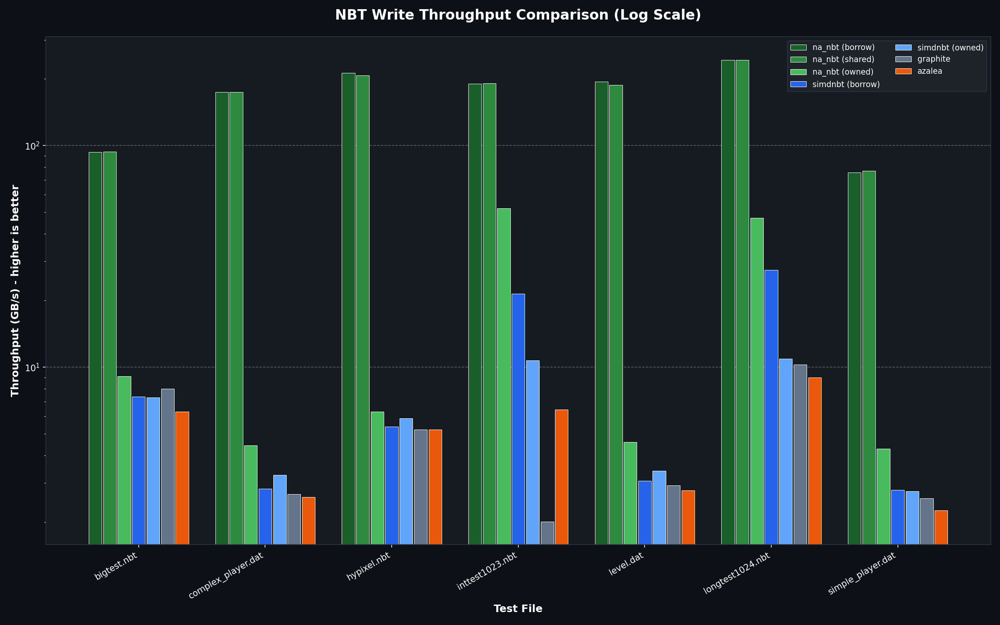
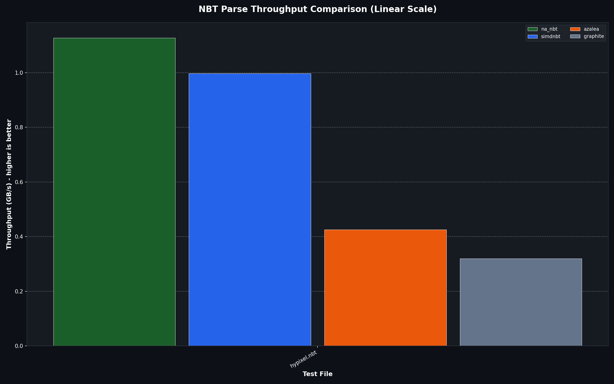

# na_nbt

A high-performance NBT (Named Binary Tag) library for Rust with full mutation support and serde integration.
see [documentation](https://docs.rs/na_nbt) for more details.

> ⚠️ **Note:** This crate is under active development. Version 0.2.0 will come within days. APIs will change.
> Issues and contributions are welcome!

## Features

- **Zero-copy parsing** - Read NBT data without allocating memory for values
- **Full mutation** - Create and modify NBT structures with an owned representation
- **Endianness support** - Convert between BigEndian and LittleEndian on read or write
- **Serde integration** - Serialize/deserialize Rust types directly to/from NBT (optional)
- **Shared values** - Thread-safe `Arc`-based values with `bytes` crate (optional)

## Installation

```toml
[dependencies]
na_nbt = "0.2"
```

### Optional Features

Both `serde` and `shared` features are enabled by default. To use without optional dependencies:

```toml
[dependencies]
na_nbt = { version = "0.2", default-features = false }

# Or enable only what you need:
na_nbt = { version = "0.2", default-features = false, features = ["serde"] }
```

| Feature  | Description                                  | Dependencies |
| -------- | -------------------------------------------- | ------------ |
| `serde`  | Serialize/deserialize Rust types to/from NBT | `serde`      |
| `shared` | `SharedValue` with Arc ownership             | `bytes`      |

## Todo

- [ ] **More convenient APIs**
- [ ] **Documentation**
- [ ] **Tests and fuzzing**
- [ ] **MSRV testing**
- [ ] **`no_std` support**
- [ ] **Older Rust support**

## Benchmarks

na_nbt is the fastest NBT library in Rust. Tests are from simdnbt's benchmark.

### Read Performance




| Library          | bigtest.nbt     | complex_player.dat | hypixel.nbt     | inttest1023.nbt  | level.dat       | longtest1024.nbt | simple_player.dat |
| ---------------- | --------------- | ------------------ | --------------- | ---------------- | --------------- | ---------------- | ----------------- |
| na_nbt (borrow)  | 30.15 GB/s (#1) | 6.36 GB/s (#1)     | 12.66 GB/s (#1) | 227.00 GB/s (#1) | 6.82 GB/s (#1)  | 592.45 GB/s (#1) | 7.24 GB/s (#1)    |
| na_nbt (shared)  | 22.24 GB/s (#2) | 6.06 GB/s (#2)     | 12.25 GB/s (#2) | 102.60 GB/s (#4) | 6.58 GB/s (#2)  | 220.53 GB/s (#4) | 5.98 GB/s (#2)    |
| simdnbt (borrow) | 18.56 GB/s (#3) | 4.89 GB/s (#3)     | 9.45 GB/s (#3)  | 150.84 GB/s (#3) | 5.38 GB/s (#3)  | 302.32 GB/s (#3) | 4.97 GB/s (#3)    |
| ussr (borrow)    | 7.42 GB/s (#4)  | 1.34 GB/s (#5)     | 3.19 GB/s (#4)  | 166.68 GB/s (#2) | 1.52 GB/s (#5)  | 365.88 GB/s (#2) | 2.09 GB/s (#5)    |
| shen             | 2.82 GB/s (#7)  | 0.72 GB/s (#7)     | 1.08 GB/s (#8)  | 0.78 GB/s (#9)   | 0.77 GB/s (#7)  | 22.34 GB/s (#6)  | 0.95 GB/s (#7)    |
| valence          | 1.92 GB/s (#10) | 0.39 GB/s (#10)    | 0.82 GB/s (#10) | 5.93 GB/s (#7)   | 0.40 GB/s (#10) | 11.35 GB/s (#10) | 0.44 GB/s (#9)    |
| azalea           | 2.73 GB/s (#8)  | 0.59 GB/s (#8)     | 1.25 GB/s (#7)  | 2.78 GB/s (#8)   | 0.59 GB/s (#8)  | 11.30 GB/s (#11) | 0.71 GB/s (#8)    |
| crab_nbt         | 1.28 GB/s (#11) | 0.29 GB/s (#11)    | 0.51 GB/s (#11) | 0.30 GB/s (#12)  | 0.31 GB/s (#11) | 15.67 GB/s (#8)  | 0.35 GB/s (#11)   |
| graphite         | 2.06 GB/s (#9)  | 0.46 GB/s (#9)     | 1.00 GB/s (#9)  | 0.66 GB/s (#10)  | 0.47 GB/s (#9)  | 11.35 GB/s (#9)  | 0.43 GB/s (#10)   |
| hematite         | 0.74 GB/s (#13) | 0.21 GB/s (#13)    | 0.43 GB/s (#13) | 0.31 GB/s (#11)  | 0.21 GB/s (#13) | 11.06 GB/s (#12) | 0.21 GB/s (#13)   |
| fastnbt          | 1.05 GB/s (#12) | 0.22 GB/s (#12)    | 0.47 GB/s (#12) | 0.23 GB/s (#13)  | 0.22 GB/s (#12) | 5.57 GB/s (#13)  | 0.22 GB/s (#12)   |
| na_nbt (owned)   | 6.69 GB/s (#5)  | 2.09 GB/s (#4)     | 2.51 GB/s (#5)  | 68.12 GB/s (#5)  | 2.18 GB/s (#4)  | 63.41 GB/s (#5)  | 2.76 GB/s (#4)    |
| simdnbt (owned)  | 3.88 GB/s (#6)  | 0.86 GB/s (#6)     | 1.74 GB/s (#6)  | 19.04 GB/s (#6)  | 0.93 GB/s (#6)  | 17.26 GB/s (#7)  | 1.18 GB/s (#6)    |

### Write Performance



| Library          | bigtest.nbt     | complex_player.dat | hypixel.nbt      | inttest1023.nbt  | level.dat        | longtest1024.nbt | simple_player.dat |
| ---------------- | --------------- | ------------------ | ---------------- | ---------------- | ---------------- | ---------------- | ----------------- |
| na_nbt (borrow)  | 93.53 GB/s (#2) | 174.44 GB/s (#1)   | 212.71 GB/s (#1) | 190.49 GB/s (#2) | 194.11 GB/s (#1) | 243.76 GB/s (#1) | 75.54 GB/s (#2)   |
| na_nbt (shared)  | 93.97 GB/s (#1) | 174.32 GB/s (#2)   | 207.66 GB/s (#2) | 191.10 GB/s (#1) | 187.29 GB/s (#2) | 243.46 GB/s (#2) | 77.02 GB/s (#1)   |
| na_nbt (owned)   | 9.11 GB/s (#3)  | 4.44 GB/s (#3)     | 6.30 GB/s (#3)   | 52.17 GB/s (#3)  | 4.59 GB/s (#3)   | 47.06 GB/s (#3)  | 4.29 GB/s (#3)    |
| simdnbt (borrow) | 7.37 GB/s (#5)  | 2.82 GB/s (#5)     | 5.39 GB/s (#5)   | 21.45 GB/s (#4)  | 3.07 GB/s (#5)   | 27.39 GB/s (#4)  | 2.79 GB/s (#4)    |
| simdnbt (owned)  | 7.29 GB/s (#6)  | 3.26 GB/s (#4)     | 5.89 GB/s (#4)   | 10.75 GB/s (#5)  | 3.40 GB/s (#4)   | 10.93 GB/s (#5)  | 2.75 GB/s (#5)    |
| azalea           | 6.30 GB/s (#7)  | 2.60 GB/s (#7)     | 5.22 GB/s (#7)   | 6.44 GB/s (#6)   | 2.78 GB/s (#7)   | 8.98 GB/s (#7)   | 2.26 GB/s (#7)    |
| graphite         | 7.97 GB/s (#4)  | 2.67 GB/s (#6)     | 5.24 GB/s (#6)   | 2.01 GB/s (#7)   | 2.93 GB/s (#6)   | 10.27 GB/s (#6)  | 2.56 GB/s (#6)    |

### Parse Performance



| Library  | hypixel.nbt    |
| -------- | -------------- |
| na_nbt   | 1.13 GB/s (#1) |
| simdnbt  | 1.00 GB/s (#2) |
| azalea   | 0.43 GB/s (#3) |
| graphite | 0.32 GB/s (#4) |

---

_Higher throughput (GB/s) is better._

## Contributing

This crate is under active development. Contributions are welcome!

- **Bug reports**: Please open an issue with a minimal reproducible example
- **Feature requests**: Open an issue describing the use case
- **Pull requests**: Fork the repo, make your changes, and submit a PR

## License

MIT OR Apache-2.0
